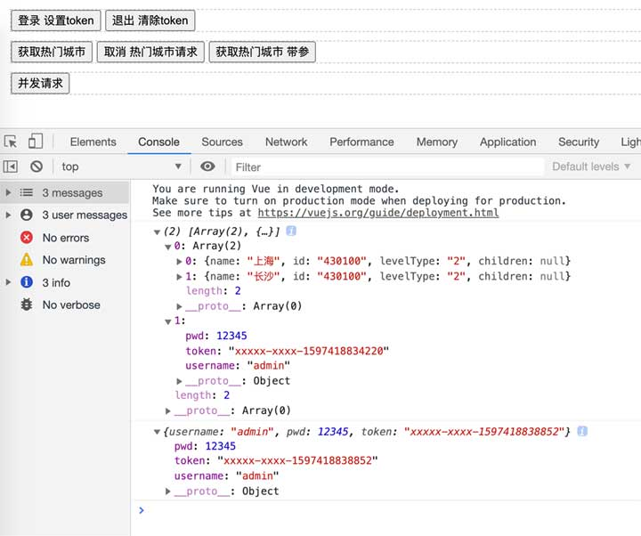
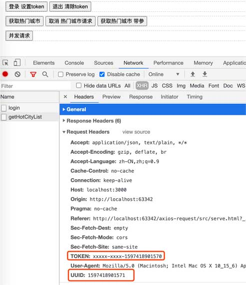

# axios-request
> 基于 axios 进行二次封装，更简单、更统一地使用 axios。 可引入vue react项目中
## 用法

克隆仓库到本地

```
git clone https://github.com/ueumd/axios-request.git
```

进入仓库根目录,安装依赖
```
npm install
```

启动node 接口服务
```
npm run serve
```

启动前端运行 serve.html

## 前端配置

```$xslt
import {http} from "./HttpRequest.js"

  http.config({
    baseURL: 'http://localhost:3000/api/v1',
    timeout: 100000,
  })

  http.setCommonHeader('TOKEN', res.token)
  http.setCommonHeader('UUID', Date.now())
```

## 前端请求

- get请求
  ```
   /**
    * @param url          接口地址
    * @param data         参数 {id:1, type:'xxx'}
    * @param header       自定义 header
    * @param timeout      自定义 超时
    * @param abort        取消请请时所用的名称
    * @param opts         其他定定义的选项
  */
  
  http.get({url, data, header = {}, abort = null, timeout, opts = {}})
  
  ```
- post请求  
```
   /**
    * @param url          接口地址
    * @param data         参数 {id:1, type:'xxx'}
    * @param header       自定义 header
    * @param timeout      自定义 超时
    * @param abort        取消请请时所用的名称
    * @param opts         其他定定义的选项
  */
  http.post({url, data, header = {}, abort = null, timeout, opts = {}})
```

- 并发请求 
```$xslt
http.all(promiseArray)
```

- 取消特定的请求
```coffeescript
http.abort('请求的称')
```

- 取消所有请求
```coffeescript
http.abortAll()
```

## 项目结构

```
src
├── serve.js       ## API接口
├── serve.html     ## 请求demo示例
├── HttpRequest.js ## 封装axios请求
```

```$xslt
<!DOCTYPE html>
<html lang="en">
<head>
  <meta charset="UTF-8">
  <title>Title</title>
  <script src="https://cdn.bootcdn.net/ajax/libs/vue/2.6.11/vue.js"></script>
  <script src="https://cdn.bootcdn.net/ajax/libs/axios/0.20.0-0/axios.js"></script>
  <style>
    .wrap {
      border: 1px dashed #ccc;
      margin: 10px;
    }
  </style>
</head>
<body>
<div id="app">
  <div class="wrap">
    <button type="button" @click="login">登录 设置token</button>
    <button type="button" @click="logout">退出 清除token</button>
  </div>

  <div class="wrap">
    <button type="button" @click="getHotCityList">获取热门城市</button>
    <button type="button" @click="abortGetHotCityList">取消 热门城市请求</button>
    <button type="button" @click="getCity">获取热门城市 带参</button>
  </div>

  <div class="wrap">
    <button type="button" @click="all">并发请求</button>
  </div>
</div>
<script type="module">
  import {http} from "./HttpRequest.js"

  http.config({
    baseURL: 'http://localhost:3000/api/v1',
    timeout: 100000,
  })

  new Vue({
    el: '#app',
    methods: {
      abortGetHotCityList(){
        http.abort('getHotCityList')
      },
      getHotCityList() {
        http.get({
          url: '/getHotCityList',
          abort: 'getHotCityList'
        }).then((res) => {
          console.log(res);
        }).catch((err) => {
          console.error(err);
        });
      },

      getCity() {
        http.get({
          url: '/getHotCityList',
          data: {
            adcode: '430100'
          },
          header: {
            uuid: Date.now() + '-' + Date.now(),
            haha: 'hhhhh'
          }
        })
        .then(res => console.log(res))
        .catch(err => {})
      },

      login(){
        http.post({
          url: '/login',
          data: {
            username: 'admin',
            pwd: 12345
          }
        }).then(res => {
          console.log(res)
          http.setCommonHeader('TOKEN', res.token)
          http.setCommonHeader('UUID', Date.now())
        })
      },

      logout(){
        http.setCommonHeader('token', '')
      },

      allTest1() {
        return http.get({
          url: '/getHotCityList',
          data: {
            adcode: '430100'
          }
        }).catch(err => {})
      },

      allTest2(){
        return http.post({
          url: '/login',
          data: {
            username: 'admin',
            pwd: 12345
          }
        }).catch(err => {})
      },

      all(){
        http.all([this.allTest1(), this.allTest2()])
        .then(res => {
          console.log(res)
        })
      }
    }
  })
</script>
</body>
</html>

```




